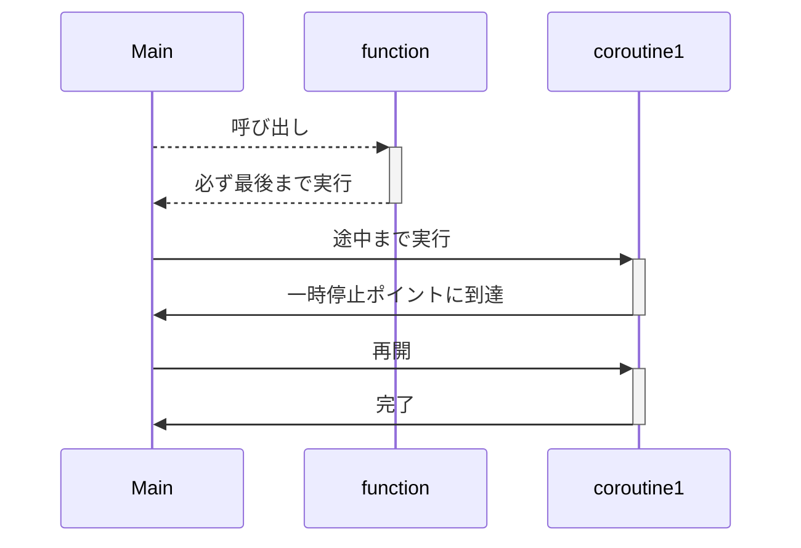

## はじめに

こんにちは[nasaちゃん](https://twitter.com/nasa_desu)です。

goroutine何も分からん!async/await何も分からん!となったのでそれぞれを比較しつつ理解を深めてみよう。という考えのもと書いたGo, Rustの並行プログラミングの解説記事を書いてみました。

ところどころふわっとしているため、補足や指摘を貰えると大変助かります。

### 今回話すこと

- goroutineとはなにか
- Goの並行処理の仕組み
- goroutine(Go)とasync/await(Rust)の比較
- Goのランタイム、Rustのランタイムの話

### 話さないこと

- 構文の違いについては特に触れない
- ベースになっている思想については特に触れない

## Go, Rustでの並行プログラミング

まずは簡単にGo, Rustで並行プログラミングをやってみましょう。

Goであれば`go`キーワードを書くだけで簡単に非同期実行されるタスク(以下非同期タスクと呼ぶことにします)を起動できますね。

```go
package main
import "fmt"

func main() {
	f := func() { fmt.Println("hoge") }
	go f()

}
```

このとき生成したタスクは自動的にランタイムに渡され、ランタイムが効率的に実行してくれています。
ランタイムが担っているタスクのスケジューリングについては後から見ていきましょう！

続いてRustの方はどうでしょうか？

RustではGoと違ってランタイムが標準でサポートされていないためタスクの実行ができません。(Rustはタスクの起動や型などは規定されていますが、どのように実行するかという部分は対象としていないようです。)

タスクを起動するためにはランタイムライブラリを用いる必要があります。本記事ではtokioというランタイムライブラリを使用します。

tokioを用いたタスクの起動は次のようになっています。現状`tokio::spawn`を`go`キーワードと同じものと考えて問題ないと思います。

`tokio::spawn`を使うことで非同期実行されるタスクを起動して、実行タイミングをランタイムに任せることが出来ています。

```rust
#[tokio::main] // ランタイムを起動するおまじない
async fn main() {
    let f = || async { println!("hoge") };

    // tokio spawnで起動している
    tokio::spawn(f());
}
```

## タスクについて

`go`や`tokio::spawn`で起動されたナニカを単にタスクと呼んでいますが適切な名前なんでしょうか？とりあえず本記事ではこれらの総称をタスクとします。

ここからはGoで起動したタスクを`ゴルーチン`、Rustで起動したタスクを非同期タスクと呼び比較してくことにします。`goroutine`は一般的な名前ですがRustでは固有の名前が無いようなので非同期タスクと命名しておきます。(`roroutine`とかにしようと思ったけど紛らわしいし、`ゴルーチン`に合わせに行く意味もないので止めておきました 🙈 )

### goroutine

ではgoroutineについて見ていきましょう。

一言でいうと、goroutineはコルーチン(goroutine)をプログラマーが扱いやすいように抽象化したものです。


うーん。なるほど？

じゃあコルーチンとは何だ？という話ですよね。コルーチンが何かを理解した後にどのように抽象化されているかを見ていきましょう。


### コルーチン

コルーチンの雰囲気がわかれば十分だと思うので概要だけを話します。

通常の関数は呼び出し後は最後まで処理を継続しますが、コルーチンは呼び出した後に処理を途中で中断し後から再開することが出来ます。

次の図を見るとイメージつきやすいかなと思います




コルーチン詳細な説明についてはこちらのスライドが参考になります。コルーチンをちゃんと理解したい人はこちらを！！

https://speakerdeck.com/sys1yagi/kotlin-korutinwo-li-jie-siyou

---


では本題に戻りましょう。
「goroutineはコルーチンをプログラマーが扱いやすいように抽象化したもの」という話でしたね。

ここでgoroutineのサンプルコードを見てみましょう。
このコードを見ていると停止、再開に相当するコードがないように見えるのですが、どうしてこれでコルーチンの一種と言えるのでしょうか？

```go
package main

import (
	"fmt"
	"time"
)

func say(s string) {
	for i := 0; i < 5; i++ {
		time.Sleep(100 * time.Millisecond)
		fmt.Println(s)
	}
}

func main() {
	go say("world")
	say("hello")
}
```

これはGoランタイムの影の努力によるものです。goでは僕らプログラマーが停止、再開のポイントを定義せずとも、ランタイムがいい感じに判定し一時停止、再開を行ってくれています。(プログラマーから触れないようになっているとも言える)

うろ覚えですが下記の時に切り替わるはずです。

- time.Sleep
- IO
- memory allocation

先程のサンプルコードではsleepがあったのでここでタスクが切り替わっているようですね。

```
func say(s string) {
	for i := 0; i < 5; i++ {
		time.Sleep(100 * time.Millisecond)  // 確かsleepでcontext switchが起きるはず
		fmt.Println(s)
	}
}
```


### 非同期タスク

続いてRustの非同期タスクについて見ていきましょう。

async/awaitによる並行プログラミングではgoと違い、再開・停止ポイントをプログラマーが決めます。

```rust
use tokio::time::{sleep, Duration};

async fn say(s: &str) {
    for _ in 0..5 {
        # 一時停止・再開ポイント
        sleep(Duration::from_millis(100)).await;
        println!("{}", s)
    }
}

#[tokio::main]
async fn main() {
    let f1 = tokio::spawn(say("world"));
    let f2 = tokio::spawn(say("hello"));

    f1.await.unwrap();
    f2.await.unwrap();
}
```

このサンプルコードでは、`sleep`のところに`await`と書くことで中断しています。他に実行できる非同期タスクが場合はランタイムはそちらの実行を始めます。

つまりRustのasync/awaitによる並行プログラミングでは非同期タスクの中にブロッキング処理を入れてしまうと他のタスクに実行権が映らず1つのタスクがCPUを専有していまいます。

例えば先程の`tokio::time::sleep`(非同期sleep)を標準ライブラリの`sleep`(同期的)を使ってしまうことで性能が低下します。

```rust
async fn say(s: &str) {
    for _ in 0..5 {
        std::thread::sleep(Duration::from_millis(100));
        println!("{}", s)
    }
}
```

Goの`goroutine`とRustの非同期タスクではパフォーマンスへの責任をランタイムが持つのかプログラマーが持つのかという違いがありそうですね。

Goの方がプログラマフレンドリーな感じがしますが、いくらかのオーバーヘッドがありそうですね。どの程度のオーバーヘッドがあるか分かっていないため今後の宿題とします。


### プリエンプティブ・ノンプリエンプティブ

先程、Rustだと非同期タスク中でブロッキング処理を行なうと他のタスクに実行が移らず、1つのタスクが専有してしまうという話をしました。

Goでも1.13までは無限ループなどがあった場合には同じように他のgoroutineが実行されないという問題があったようです。

しかしgo 1.14から改善され、コンパイル時に「タスクがしばらく実行されていることを検知してランタイムに戻るコード」を挿入する用になったようです。便利！

Goではランタイムがどの程度タスクを実行するかを決められますが、Rust(tokio)だとそれは出来ないようですね。


## タスクスケジューリングについて

続いて起動(生成？)したタスクがどのようにランタイムで実行されているかを見ていきましょう。

これはRust(tokio)とGoであまり違いがないようなのでGoのランタイムを見ていきましょう。その後細かな違いについて説明していけたらと思います。

**ここで説明しているランタイムの動作は古いものかもしれません。ご注意を**

タスクは基本的にM個のOSスレッド上に構築されたN個のグリーンスレッド上で実行されます。(M:Nモデルと呼ばれていますね)


ランタイムは起動時にCPU数と同じ数だけのOSスレッドを起動します。これらOSスレッド

## まとめ

- Goはランタイムが標準でついているので考える必要がないよ、Rustではランタイムライブラリを使う必要があるよ
- Goはランタイムが中断再開を管理するよ、Rustではプログラマーが管理するよ
  - ブロッキング処理を混入しちゃうと危険だね
  - Goはプリエンプティブだよ, Rustだとノンプリエンプティブだよ
- どっちもワークスティーリングというスケジュール戦略を使っているよ
  - Goはタスク本体ではなく継続を盗み合っているよ
  - Rustはタスク本体を盗み合っているよ


## 参考文献、関連資料

- [Reducing tail latencies with automatic cooperative task yielding](https://tokio.rs/blog/2020-04-preemption)
- [Kotlin コルーチンを 理解しよう](https://speakerdeck.com/sys1yagi/kotlin-korutinwo-li-jie-siyou)
- [Go言語による並行処理](https://www.oreilly.co.jp/books/9784873118468/)
- [並行プログラミング入門](https://www.oreilly.co.jp/books/9784873119595/)

---

以下メモ (1100文字ある)

### アウトライン

- タイトル
- 自己紹介
  - こんにちはnasaです。
  - 一言
- 今回話すこと
  - 結局goroutineとはなにか？
  - Rust, Goの並行プログラミングを比較する
  - RustのランタイムとGoのランタイムの違いについて
- Go, Rustの並行プログラミングについて
  - プログラマーが非同期タスクを生成。(goキーワードやasync構文)
- goの並行プログラミングを理解
  - goroutineとは？
    - coroutineの一種
      - coroutineをプログラマーが扱いやすいように抽象化したもの
    - coroutineとは
      - 中断可能な計算インスタンス
      - coroutineのいい感じの説明をする
      - サンプルコードを元に再開中断の話をする
    - 特性
      - 再開中断ポイントがコンパイラによって挿入される
      - プリエンプティブ
        - コンパイル時に「タスクがしばらく実行されていることを検知してランタイムに戻るコード」を挿入する
  - スケジューリングアルゴリズムについて
    - OSスレッドの上にグリーンスレッドを構築している(M:Nスレッド)
    - メインスレッドがあり、複数のワーカースレッドがある
    - ワークスティーリングアルゴリズムを採用している
      - タスクスティーリングではなく継続スティーリング
- Rustの並行プログラミングを理解
  - async/awaitとは？
    - これは単に構文の話をしているはず。
    - coroutineを人間が扱いやすいように抽象化したもの
  - スケジューリングアルゴリズムについて
- 何が違うんだろうか。それぞれの特色をまとめる
  - 思想の違い
    - プリエンプティブ、非プリエンプティブ
