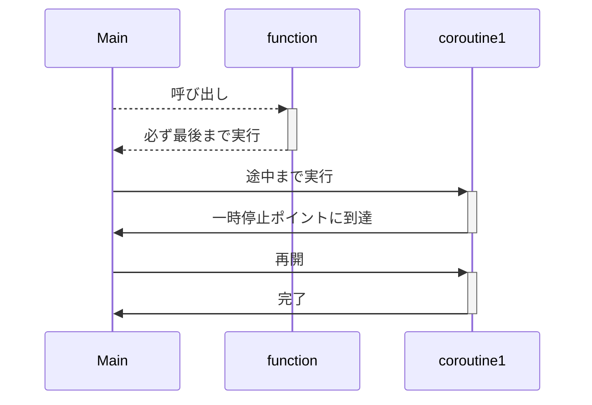

## はじめに

こんにちは[nasaちゃん](https://twitter.com/nasa_desu)です。

goroutine何も分からん!async/await何も分からん!となったのでそれぞれを比較しつつ理解を深めてみよう。という考えのもと書いたGo, Rustの並行プログラミングの解説記事です。

ところどころふわっとしているため、補足や指摘を貰えると大変助かります。

### 誰向けに話すか

- 雰囲気で並行プログラミングを行っている人
- goやRustの並行処理の仕組みを理解したい人
- Go, Rustどちらかを知っている人

### 今回話すこと

- goroutineとはなにか
- Goのランタイム、Rustのランタイムの話

### 話さないこと

- 書き方の違いについては特に触れない

## Go, Rustでの並行プログラミング

まずは簡単にGo, Rustで並行プログラミングをやってみましょう。

Goであれば`go`キーワードを書くだけで簡単に非同期実行されるタスク(以下非同期タスクと呼ぶことにします)を起動できますね。

```go
package main
import "fmt"

func main() {
	f := func() { fmt.Println("hoge") }
	go f()

}
```

このとき生成したタスクは自動的にランタイムに渡され、ランタイムが効率的に実行してくれています。
ランタイムが担っているタスクのスケジューリングについては後から見ていきましょう！

続いてRustの方はどうでしょうか？

RustではGoと違ってランタイムが標準でサポートされていないためタスクの実行ができません。(Rustはタスクの起動や型などは規定されていますが、どのように実行するかという部分は対象としていないようです。)

タスクを起動するためにはランタイムライブラリを用いる必要があります。本記事ではtokioというランタイムライブラリを使用します。

tokioを用いたタスクの起動は次のようになっています。現状`tokio::spawn`を`go`キーワードと同じものと考えて問題ないと思います。

`tokio::spawn`を使うことで非同期実行されるタスクを起動して、実行タイミングをランタイムに任せることが出来ています。

```rust
#[tokio::main] // ランタイムを起動するおまじない
async fn main() {
    let f = || async { println!("hoge") };

    // tokio spawnで起動している
    tokio::spawn(f());
}
```


## タスクについて

`go`や`tokio::spawn`で起動されたナニカを単にタスクと呼んでいますが適切な名前なんでしょうか？とりあえず本記事ではこれらの総称をタスクとします。

ここからはGoで起動したタスクを`ゴルーチン`、Rustで起動したタスクを非同期タスクと呼び比較してくことにします。`goroutine`は一般的な名前ですがRustでは固有の名前が無いようなので非同期タスクと命名しておきます。(`roroutine`とかにしようと思ったけど紛らわしいし、`ゴルーチン`に合わせに行く意味もないので止めておきました 🙈 )

### goroutine

ではgoroutineについて見ていきましょう。

一言でいうと、goroutineはコルーチン(goroutine)をプログラマーが扱いやすいように抽象化したものです。


うーん。なるほど？

じゃあコルーチンとは何だ？という話ですよね。コルーチンが何かを理解した後にどのように抽象化されているかを見ていきましょう。


### コルーチン

コルーチンの雰囲気がわかれば十分だと思うので概要だけを話します。

通常の関数は呼び出し後は最後まで処理を継続しますが、コルーチンは呼び出した後に処理を途中で中断し後から再開することが出来ます。

次の図を見るとイメージつきやすいかなと思います




コルーチン詳細な説明についてはこちらのスライドが参考になります。コルーチンをちゃんと理解したい人はこちらを！！

https://speakerdeck.com/sys1yagi/kotlin-korutinwo-li-jie-siyou

---


では本題に戻りましょう。
「goroutineはコルーチンをプログラマーが扱いやすいように抽象化したもの」という話でしたね。


goroutineは軽量スレッドであるという話をよく聞きますが、goroutine本体がスレッドというより、複数のgoroutineの再開、停止を組み合わせることによってユーザー空間にスレッドを構築している。という話だと思っています。(**`goroutine`が何を指すかは公式ドキュメントに書いて有りそうですが、調べられていないです :bow:**)

本記事では`go`キーワードで起動したタスクを`goroutine`と呼んでいます。`goroutine`はランタイムと密に結合しているため軽量スレッドであるとも言えそうですが、`goroutine` == コルーチン, 軽量スレッドに昇華しているのはランタイムによるものと解釈しています。

## まとめ

- Goはランタイムが標準でついているので考える必要がないよ、Rustではランタイムライブラリを使う必要があるよ

---

以下メモ

### アウトライン

- タイトル
- 自己紹介
  - こんにちはnasaです。
  - 一言
- 今回話すこと
  - 結局goroutineとはなにか？
  - Rust, Goの並行プログラミングを比較する
  - RustのランタイムとGoのランタイムの違いについて
- Go, Rustの並行プログラミングについて
  - プログラマーが非同期タスクを生成。(goキーワードやasync構文)
- goの並行プログラミングを理解
  - goroutineとは？
    - coroutineの一種
      - coroutineをプログラマーが扱いやすいように抽象化したもの
    - coroutineとは
      - 中断可能な計算インスタンス
      - coroutineのいい感じの説明をする
      - サンプルコードを元に再開中断の話をする
    - 特性
      - 再開中断ポイントがコンパイラによって挿入される
      - プリエンプティブ
        - コンパイル時に「タスクがしばらく実行されていることを検知してランタイムに戻るコード」を挿入する
  - スケジューリングアルゴリズムについて
    - OSスレッドの上にグリーンスレッドを構築している(M:Nスレッド)
    - メインスレッドがあり、複数のワーカースレッドがある
    - ワークスティーリングアルゴリズムを採用している
      - タスクスティーリングではなく継続スティーリング
- Rustの並行プログラミングを理解
  - async/awaitとは？
    - これは単に構文の話をしているはず。
    - coroutineを人間が扱いやすいように抽象化したもの
  - スケジューリングアルゴリズムについて
- 何が違うんだろうか。それぞれの特色をまとめる
  - 思想の違い
    - プリエンプティブ、非プリエンプティブ


### タイトル案

- goroutineとasync/await
- goの並行プログラミングとRustの並行プログラミング
- GoとRust 並行プログラミング編
- GoとRust 無限並行プログラミング編

### 誰向けに話すか

- 雰囲気で並行プログラミングを行っている人
- goにおける並行処理の仕組みを理解したい人
- 他の言語の並行プログラミングと比べてどうなの？と思っている人


### 発表のゴール

- goroutine, goのスケジューラーへの知見が深まること
- go以外の並行プログラミングを知ることでgoの並行プログラミングの良し悪しを知る

