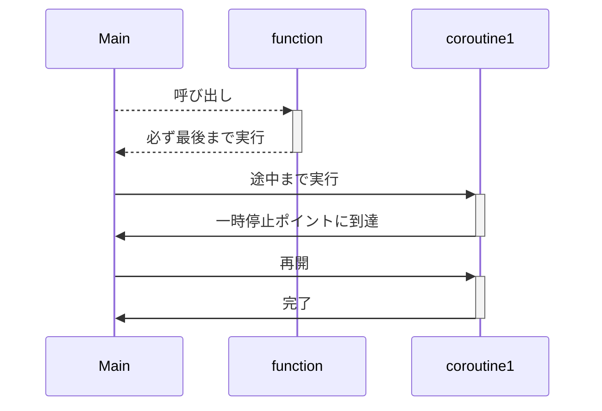

## はじめに

こんにちは[nasaちゃん](https://twitter.com/nasa_desu)です。

goroutine何も分からん!async/await何も分からん!となったのでそれぞれを比較しつつ理解を深めてみよう。という考えのもと書いたGo, Rustの並行プログラミングの解説記事を書いてみました。

ところどころふわっとしているため、補足や指摘を貰えると大変助かります。

### 今回話すこと

- goroutineとはなにか
- Goの並行処理の仕組み
- goroutine(Go)とasync/await(Rust)の比較
- Goのランタイム、Rustのランタイムの話

### 話さないこと

- 構文の違いについては特に触れない
- ベースになっている思想については特に触れない

## TL;DR

- Goには標準のランタイムがあるよ、Rustではランタイムライブラリを使う必要があるよ
- Goはランタイムが中断再開を管理するよ、Rustではプログラマーが管理するよ
  - ブロッキング処理を混入しちゃうと危険だね
  - Goはプリエンプティブだよ, Rustだとノンプリエンプティブだよ
- どっちもタスクのスケジューリングはワークスティーリングという戦略だよ
  - Goはタスク本体ではなく継続を盗み合っているよ(継続ワークスティーリング)
  - Rustはタスク本体を盗み合っているよ (チャイルドワークスティーリング)

## Go, Rustでの並行プログラミング

まずは簡単にGo, Rustで並行プログラミングをやってみましょう。

Goであれば`go`キーワードを書くだけで簡単に非同期実行されるタスク(以下非同期タスクと呼ぶことにします)を起動できますね。

```go
package main
import "fmt"

func main() {
	f := func() { fmt.Println("hoge") }
	go f()
}
```

このとき生成したタスクは自動的にランタイムに渡され、ランタイムが効率的に実行してくれています。
ランタイムが担っているタスクのスケジューリングについては後から見ていきましょう！

続いてRustの方はどうでしょうか？

RustではGoと違ってランタイムが標準でサポートされていないためタスクの実行ができません。(Rustはタスクの起動や型などは規定されていますが、どのように実行するかという部分は対象としていないようです。)

タスクを起動するためにはランタイムライブラリを用いる必要があります。本記事ではtokioというランタイムライブラリを使用します。「Rustでは」と言ったときは殆どの場合が「Rustのランタイムのtokiでは」という話になります。

tokioを用いたタスクの起動は次のようになっています。現状`tokio::spawn`を`go`キーワードと同じものと考えて問題ないと思います。

`tokio::spawn`を使うことで非同期実行されるタスクを起動して、実行タイミングをランタイムに任せることが出来ています。

```rust
#[tokio::main] // ランタイムを起動するおまじない
async fn main() {
    let f = || async { println!("hoge") };

    // tokio spawnで起動している
    tokio::spawn(f());
}
```

## タスクについて

`go`や`tokio::spawn`で起動されたナニカを単にタスクと呼んでいますが適切な名前なんでしょうか？とりあえず本記事ではこれらの総称をタスクとします。

ここからはGoで起動したタスクを`goroutine`、Rustで起動したタスクを非同期タスクと呼び比較してくことにします。`goroutine`は一般的な名前ですがRustでは固有の名前が無いようなので非同期タスクと命名しておきます。(`roroutine`とかにしようと思ったけど紛らわしいし、`ゴルーチン`に合わせに行く意味もないので止めておきました 🙈 )

### goroutine

ではgoroutineについて見ていきましょう。

一言でいうと、goroutineはコルーチン(goroutine)をプログラマーが扱いやすいように抽象化したものです。

うーん。なるほど？

じゃあコルーチンとは何だ？という話ですよね。コルーチンが何かを理解した後にどのように抽象化されているかを見ていきましょう。


### コルーチン

コルーチンの雰囲気がわかれば十分だと思うので概要だけを話します。

通常の関数は呼び出し後は最後まで処理を継続しますが、コルーチンは呼び出した後に処理を途中で中断し後から再開することが出来ます。

次の図を見るとイメージつきやすいかなと思います



goroutineも非同期タスクも中断と再開を繰り返しているためコルーチンの一種と言えそうですね。

コルーチン詳細な説明についてはこちらのスライドが参考になります。コルーチンをちゃんと理解したい人はこちらを！！

https://speakerdeck.com/sys1yagi/kotlin-korutinwo-li-jie-siyou

---


では本題に戻りましょう。
「goroutineはコルーチンをプログラマーが扱いやすいように抽象化したもの」という話でしたね。

ここでgoroutineのサンプルコードを見てみましょう。
このコードを見ていると停止、再開に相当するコードがないように見えるのですがどこが中断・再開のポイントとなるのでしょうか？

```go
package main

import (
	"fmt"
	"time"
)

func say(s string) {
	for i := 0; i < 5; i++ {
		time.Sleep(100 * time.Millisecond)
		fmt.Println(s)
	}
}

func main() {
	go say("world")
	say("hello")
}
```

これはGoランタイムの影の努力によるものです。goでは僕らプログラマーが中断・再開のポイントを定義せずとも、ランタイムがいい感じに判定して中断・再開を行ってくれています。(プログラマーから触れないようになっているとも言える)

うろ覚えですが下記の時に切り替わるはずです。

- time.Sleep
- IO
- memory allocation

先程のサンプルコードではsleepがあったのでここでタスクが切り替わっているようですね。

```rust
func say(s string) {
	for i := 0; i < 5; i++ {
		time.Sleep(100 * time.Millisecond)  // 確かsleepでcontext switchが起きるはず
		fmt.Println(s)
	}
}
```


### 非同期タスク

続いてRustの非同期タスクについて見ていきましょう。

Rustでの並行プログラミングではGoと違い、再開・停止ポイントをプログラマーが決めることになります。

```rust
use tokio::time::{sleep, Duration};

async fn say(s: &str) {
    for _ in 0..5 {
        // 一時停止・再開ポイント
        sleep(Duration::from_millis(100)).await;
        println!("{}", s)
    }
}

#[tokio::main]
async fn main() {
    let f1 = tokio::spawn(say("world"));
    let f2 = tokio::spawn(say("hello"));

    f1.await.unwrap();
    f2.await.unwrap();
}
```

このサンプルコードでは、`sleep`のところに`await`と書くことで中断ポイントであることを明記しています。ランタイムの実装によりますが、他に実行できる非同期タスクが場合はランタイムはそちらの実行を始めることで効率的に複数の非同期タスクを処理することが出来ます。

つまりRustのasync/awaitによる並行プログラミングでは非同期タスクの中にブロッキング処理を入れてしまうと他のタスクに実行権が映らず1つのタスクがCPUを専有していまいます。

例えば先程の`tokio::time::sleep`(非同期sleep)を標準ライブラリの`sleep`(同期的)を使ってしまうことで性能が低下します。

```rust
async fn say(s: &str) {
    for _ in 0..5 {
        // ここで処理がブロックし、このタスクが専有してしまう
        std::thread::sleep(Duration::from_millis(100));
        println!("{}", s)
    }
}
```

Goの`goroutine`とRustの非同期タスクではパフォーマンスへの責任をランタイムが持つのかプログラマーが持つのかという違いがありそうですね。

Goの方がプログラマフレンドリーな感じがしますが、いくらかのオーバーヘッドがあるようです。どの程度のオーバーヘッドがあるか分かっていないため今後の僕の宿題とします。


### プリエンプティブ・ノンプリエンプティブ

先程、Rustだと非同期タスク中でブロッキング処理を行なうと他のタスクに実行が移らず、1つのタスクが専有してしまうという話をしました。

Goでも1.13までは無限ループなどがあった場合には同じように他のgoroutineが実行されないという問題があったようです。

しかしgo 1.14から改善され、コンパイル時に「タスクがしばらく実行されていることを検知してランタイムに戻るコード」を挿入する用になったようです。便利！
tokioはただのライブラリなのでここまで手厚いことは出来ません。

Goではランタイムがどの程度タスクを実行するかを決められますが、tokio(Rust)だと出来ませんね。

Goのようにランタイムがタスクの実行を中断して他のタスクの実行に移るようなマルチタスク方法をプリエンプティブマルチタスクと良い、Rust(というかasync/await？)のようにタスクが自発的に実行権を明け渡すようなマルチタスク方法をノンプリエンプティブマルチタスクまたは、協調的マルチタスクと呼びます。

GoとRustには次の違いがあることが分かりますね。

- Goはプリエンプティブマルチタスク
- Rustはノンプリエンプティブマルチタスク

## タスクスケジューリングについて

続いて起動(生成？)したタスクがどのようにランタイムで実行されているかを見ていきましょう。

これはRust(tokio)とGoであまり違いがないようなのでGoのランタイムを見ていきましょう。その後細かな違いについて説明していけたらと思います。

**注意: ここで説明しているランタイムの動作は古いものかもしれません**

タスクは基本的にM個のOSスレッド上に構築されたN個のグリーンスレッド上で実行されます。(M:Nモデルと呼ばれるものです)

次の図を見るとイメージが付きやすいかもしれません。


OS threadのスケジューリングはOSが行っています。このように複数のOS threadを使うことでマルチコアを効率的に使うことが出来ます。


### 余談！ 軽量スレッドゴルーチンとOSスレッドの話

OS threadのスケジューリングを行ってくれるなら、ランタイムでタスクを管理するのを止めて1つのタスクにつきOSスレッド1つという構成にしたらいいのでは？という考えが浮かぶかと思います。(これは1:1モデルと呼ばれています)


しかしこれはシンプルになる一方でパフォーマンス上のデメリットがいくつかあります。

課題となるのは次の２つです。

1. メモリ使用量
2. コンテキストスイッチ

linuxのOS threadはデフォルトのスタックサイズが2MBに設定されているようです。したがってos threadをポコポコ立ててしまうとメモリを大量に使ってしまうことになります。goroutineではデフォルトのスタックサイズは2KBとなっておりgoroutineが軽量スレッドと言われている理由がわかりますね。


コンテキストスイッチのコストもgoroutineと比べて高いようです。(このへんはあまり理解できていないので話半分くらいで聞いてください！)

OS Threadの切り替えにかかるコストは、CPU レジスタの切り替え(コンテキストの保持と復元)のみで、スタックポインタ(SP)とプログラムカウンタ(PC)を切り替えれば済みそう？と思っているのですが、未だにOS threadの切り替えは高コストらしいです。(他にも切り替える必要があるのかな？)

goroutineとOS threadのベンチマーカーによるとOS threadの切り替えは1.4μsに対して、goroutineの切り替えは225nsで終わるようです。(リンクが消失した、、ごめんなさい)

goroutineはOS threadと比べコンテキストスイッチが素早く、メモリ使用量も少ないため大量に生成することが出来ますね。

---

続いてランタイムのタスクスケジューリングの話です。

Goやtokioのタスクスケジューラーには次の登場人物がいます。

- global task queue: その名の通りグローバルなタスクキュー
- local task queue: 1 osスレッドにつき1つのローカルタスクキューがある
- processor: CPUを抽象化したもの。タスクの実行はこいつが行っている
- OS thread


processorにタスクが割り当てられていないとき(実行すべきタスクがないとき)にタスクの探索が始まります。(探索順序はGo, Rustで異なるかもしれませんが、ここでは特に気にしないことにします)
実行すべきタスクの探索対象となるのは次の4つですね。


3つめの他のprocessorのローカルキューからタスクを**盗む**ことからこのアルゴリズムはワークスティーリングと呼ばれています。これにより、1つのprocessorにタスクが集中したとしても他のprocessorに処理を分散することが出来、効率的にタスクを処理していくことが出来ます。


## チャイルドスティーリング・継続スティーリング

GoとRustを比べるのもここで最後になります。
先程説明したワークスティーリングアルゴリズムにはチャイルドスティーリングと継続スティーリングの２種類があります。

Goは継続スティーリングでRustはチャイルドスティーリングです。

まずはピンとこないであろう継続が何かから説明してきます。先程のgoのサンプルコードを用いて継続を説明します。goroutineなどのタスク起動後に実行されるコード、ここでは`say("hello")`が継続です。

```go
func say(s string) {
	for i := 0; i < 5; i++ {
		time.Sleep(100 * time.Millisecond)
		fmt.Println(s)
	}
}

func main() {
	go say("world") // タスク
	say("hello") // 継続
}
```


先程のスケジューリングの説明ではタスクがキューに出入りして実行されていると説明しましたが、Goでは本当は継続が出入りして実行されています。
継続スティーリングは性能上の利点があるためGoで採用されています。(力尽きてしまったので追記 or 別記事に書きたい)

継続スティーリングはコンパイラのサポートが必要になるらしく、Rustでは採用できていないのが現状です。Rustではスケジューリングのときに説明したタスクがキューを出入りするチャイルドスティーリングという方式を取っています。


## まとめ

最後は駆け足過ぎましたがこれにてGo,Rustの並行プログラミングは終わりです。

- Goには標準のランタイムがあるよ、Rustではランタイムライブラリを使う必要があるよ
- Goはランタイムが中断再開を管理するよ、Rustではプログラマーが管理するよ
  - ブロッキング処理を混入しちゃうと危険だね
  - Goはプリエンプティブだよ, Rustだとノンプリエンプティブだよ
- どっちもタスクのスケジューリングはワークスティーリングという戦略だよ
  - Goはタスク本体ではなく継続を盗み合っているよ(継続ワークスティーリング)
  - Rustはタスク本体を盗み合っているよ (チャイルドワークスティーリング)

## 参考文献、関連資料

- [Reducing tail latencies with automatic cooperative task yielding](https://tokio.rs/blog/2020-04-preemption)
- [Kotlin コルーチンを 理解しよう](https://speakerdeck.com/sys1yagi/kotlin-korutinwo-li-jie-siyou)
- [Go言語による並行処理](https://www.oreilly.co.jp/books/9784873118468)
- [並行プログラミング入門](https://www.oreilly.co.jp/books/9784873119595)
